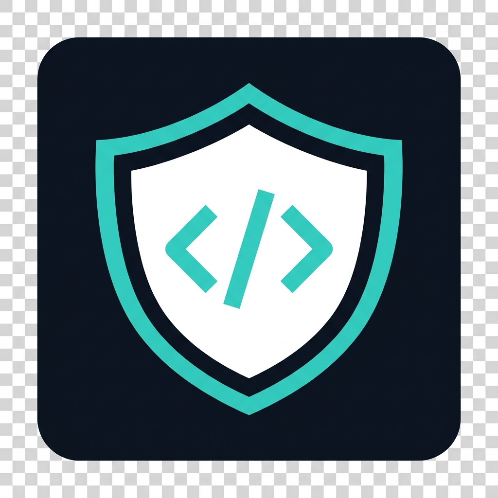

<p align="center">
  
</p>

<h1 align="center">JSRecon — JavaScript Reconnaissance Tool</h1>

<p align="center">
  <strong>A passive JavaScript asset reconnaissance &amp; sensitive information detection Chrome Extension for ethical security research.</strong>
</p>

<p align="center">
  
  
  
  
</p>

---

## 📸 Preview

<!-- Replace the path below with your actual screenshot -->


---

## 🔍 What is JSRecon?

**JSRecon** is a Chrome Extension built for **bug bounty hunters**, **penetration testers**, and **security researchers**. It passively analyzes JavaScript files loaded by any website to discover:

- 🔑 **Exposed API Keys** (AWS, Google, Stripe, OpenAI, GitHub, GitLab)
- 🎫 **JWT Tokens** leaked in client-side code
- 📧 **Email Addresses** embedded in scripts
- 🔐 **Hardcoded Passwords** in JavaScript assignments
- 🧬 **High-Entropy Secrets** (tokens, private keys, API secrets)
- 🌐 **API Endpoints** (`/api/`, `/v1/`, `/graphql`, `fetch()`, `axios` calls)

> ⚠️ **This tool is for authorized security testing only.** Do not use it on systems you do not have permission to test.

---

## ✨ Key Features

| Feature | Description |
|---|---|
| **Manual Execution Only** | Scans only when you click "Start Scan" — no background activity |
| **Minimal Permissions** | Uses only `activeTab`, `scripting`, `storage` — no `<all_urls>` |
| **Secret Detection** | Regex + Shannon entropy-based detection with confidence scoring |
| **Endpoint Extraction** | Discovers API routes, auth endpoints, admin paths from JS files |
| **False Positive Filtering** | Filters out placeholder values, test strings, and low-entropy matches |
| **Value Masking** | Secrets are masked in the UI (`ai***X9k2`) for safe viewing |
| **JSON Export** | Download a full structured report with unmasked values |
| **Dark Mode UI** | Professional security-tool aesthetic with tabbed results |

---

## 🏗️ Architecture

```
JSReconExtension/
├── manifest.json            # Chrome Extension Manifest V3
├── popup.html               # Extension popup UI
├── popup.js                 # UI orchestration & scan trigger
├── background.js            # Service worker (fetch + processing)
├── secret_scanner.js        # Sensitive information detection engine
├── endpoint_scanner.js      # API endpoint extraction engine
├── style.css                # Dark-mode UI styling
├── icons/
│   ├── icon16.png
│   ├── icon48.png
│   └── icon128.png
└── README.md
```

### Scan Flow

```
User clicks "Start Scan"
        │
        ▼
   popup.js ──► chrome.scripting.executeScript()
        │           │
        │           ▼
        │     Active Tab DOM
        │     (extract <script> URLs)
        │           │
        ▼           ▼
   background.js ◄── JS URL list
        │
        ├──► Fetch JS file contents
        ├──► secret_scanner.js (detect secrets)
        └──► endpoint_scanner.js (extract endpoints)
                    │
                    ▼
              Structured results
                    │
                    ▼
              Popup UI (3 tabs)
```

---

## 🚀 Installation

### From Source (Developer Mode)

1. **Clone this repository:**

   ```bash
   git clone https://github.com/MShaheer15/JsReconExtension.git
   ```

2. **Open Chrome** and navigate to:

   ```
   chrome://extensions/
   ```

3. **Enable Developer Mode** (toggle in the top-right corner)

4. **Click "Load unpacked"** and select the `JSReconExtension` folder

5. **Pin the extension** to your toolbar for quick access

---

## 📖 Usage

### Step 1 — Navigate to a Target

Open any website you are **authorized** to test in Chrome.

### Step 2 — Open JSRecon

Click the **JSRecon icon** in your Chrome toolbar. The popup will display the current target URL.

### Step 3 — Start Scan

Click the **"Start Scan"** button. The extension will:

1. Extract all `<script src="...">` tags from the page
2. Fetch the contents of each JavaScript file
3. Analyze for secrets and endpoints
4. Display results in the popup

### Step 4 — Review Results

Results are organized into **3 tabs**:

| Tab | Content |
|---|---|
| **JS Files** | All discovered JavaScript files (first-party vs third-party) |
| **Secrets** | Detected API keys, JWTs, emails, passwords with severity & confidence |
| **Endpoints** | Extracted API routes, auth paths, fetch/axios URLs |

### Step 5 — Export

- 📋 **Copy** — Copy all findings to clipboard as plain text
- 📥 **Export JSON** — Download a structured `.json` report

---

## 🔬 Detection Capabilities

### Secret Detection

| Type | Examples | Severity |
|---|---|---|
| AWS Access Key | `AKIA...` | 🔴 High |
| Google API Key | `AIzaSy...` | 🔴 High |
| Stripe Secret Key | `sk-...` | 🔴 High |
| GitHub Token | `ghp_...` | 🔴 High |
| JWT Token | `eyJhbG...` | 🔴 High |
| Hardcoded Password | `password = "..."` | 🔴 High |
| High-Entropy Secret | Long random strings | 🟡 Medium |
| Email Address | `user@domain.com` | ⚪ Low |

### Endpoint Detection

| Type | Pattern | Example |
|---|---|---|
| `fetch()` URL | `fetch("...")` | `fetch("/api/users")` |
| Axios Request | `axios.get("...")` | `axios.post("/v1/data")` |
| API Path | `/api/...`, `/v1/...` | `/api/auth/login` |
| GraphQL | `/graphql` | `/graphql/query` |
| Admin Path | `/admin`, `/dashboard` | `/admin/settings` |
| Auth Endpoint | `/login`, `/oauth` | `/auth/callback` |

---

## 🛡️ Ethical Guidelines

This tool is designed for **authorized security testing only**. By using JSRecon, you agree to:

- ✅ Only scan websites you have **explicit permission** to test
- ✅ Use findings for **responsible disclosure** and improving security
- ✅ Respect **bug bounty program scopes** and rules
- ❌ **Never** use this tool for unauthorized access or exploitation
- ❌ **Never** use detected secrets for malicious purposes

The extension operates in **fully passive mode**:
- No request modification
- No payload injection
- No exploitation attempts
- Read-only analysis of publicly accessible JavaScript

---

## 🧪 Testing

You can test JSRecon on:

- **Your own projects** running on `localhost`
- **Public bug bounty targets** (within their authorized scope)
- **Any website** where you have written authorization

---

## 🤝 Contributing

Contributions are welcome! Here's how:

1. Fork this repository
2. Create a feature branch: `git checkout -b feature/new-detection`
3. Commit your changes: `git commit -m "Add new detection pattern"`
4. Push to the branch: `git push origin feature/new-detection`
5. Open a Pull Request

### Ideas for Contributions

- Additional secret detection patterns
- Improved false-positive filtering
- Source map analysis
- Inline script analysis
- Dark/light theme toggle

---

## 📄 License

This project is licensed under the **MIT License**. See the [LICENSE](LICENSE) file for details.

---

## ⚠️ Disclaimer

This tool is provided for **educational and authorized security testing purposes only**. The developers are not responsible for any misuse or damage caused by this tool. Always obtain proper authorization before testing any systems.

---

<p align="center">
  Made with ☕ for the security community
</p>
